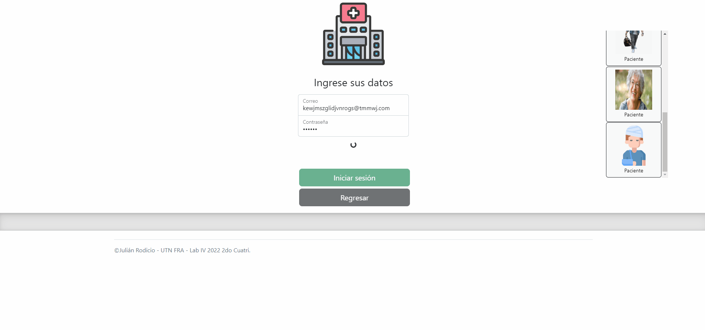

# Clínica Online

  

Sistema de gestión de turnos para nuestra Clinica Online con el que podrán gestionar e interactuar tanto profesionales prestadores de servicio como los pacientes que requieran cualquier tipo de atención brindado.

# :information_source: ¿Qué funcionalidades cumple actualmente el sistema?
- Gestión de perfiles para pacientes, especialistas y administradores.
- Configuración flexible de horarios para que los especialistas detallen su disponibilidad horaria.
- Metodología dinámica y amigable para la solicitud de turnos por parte de los pacientes.
- Seguimiento de turnos por todos los usuarios.
- Control de informes médicos: Como paciente, podrás ver en cualquier momento el informe médico cargado por los profesionales.
- Informes: Como administrador, podrás visualizar distintos informes y gráficos dentro del sistema y bajarlos en PDF.

# :information_source: ¿Cómo funciona la aplicación?

La aplicación web permite gestionar sus turnos desde cualquier lugar siempre y cuando posea conexión a Internet.
Se encuentra totalmente orientado a la facilidad de gestión y que cada perfil solo tenga acceso a aquellos sectores con los cuales pueda interactuar.

# :information_source: Contenido de la aplicación

## Bienvenida

Página inicial donde cualquier usuario no identificado podrá indicar si quiere identificarse o registrarse con una nueva cuenta de usuario.

## Login de usuario

Permitirá acceder al sistema con una cuenta de usuario previamente registrada, validada y, en el caso de los especialistas, aprobada por un administrador.
Posee un contenedor flotante del lado derecho con botones para faciliar el acceso con usuarios de distintos perfiles del lado derecho en la fase de desarrollo.

## Registro de usuario

Al momento de registrarnos desde el menú de bienvenida, nos van a solicitar indicar el tipo de cuenta que crearemos: Paciente o Especialista.
Cada formulario tiene sus campos necesarios con distintas validaciones, todos los usuarios deberán comprobar su correo mediante el link enviado a su casilla personal. Tenga en cuenta que en el caso de un usuario Especialista se requerirá la aprobación de un administrador antes de poder iniciar sesión.

## Home

Es la pantalla inicial donde cada usuario va a visualizar la barra de navegación superior. La misma solo mostrará aquellas secciones a las cuales nuestro usuario tiene permisos.

## Sección Usuarios

Permitirá a los administradores visualizar a todos los usuarios registrados con sus datos, habilitar o deshabilitar a los especialistas y realizar el alta de nuevas cuentas de usuarios.
Al seleccionar un paciente se descargará automáticamente un XLSX con todos los turnos que haya tomado, informando el especialista, la especialidad, la fecha y la hora. También podremos visualizar su historial clínico según lo que han cargado los especialistas en cada turno realizado.
Al final de la sección, dispondremos 3 botones para dar de alta usuarios con distintos perfiles: Pacientes, Especialistas y Administradores.

## Sección Turnos

Permitirá a los administradores visualizar todos los turnos del sistema y cancelar aquellos que necesite. Tendrá la posibilidad de filtrar por Especialidad o Especialista.

## Sección Solicitar turnos

Permitirá a un paciente solicitar un turno para la especialidad deseada, con el profesional deseado. Un administrador puede utilizar la misma sección para solicitar el turno para un paciente, con la diferencia de que tendrá que seleccionar primero a que paciente asociará dicho turno.

## Sección Gráficos & Estadísticas

Permitirá al administrador visualizar los distintos gráficos y estadísticas que se encuentran en la web. Todos los gráficos se pueden descargar en formato .PDF.

## Sección Mis turnos

### Especialista

Visualizaremos el listado de turnos asignados al especialista logueado. Podremos filtrar por Paciente o Especialidad, además tenemos un filtro adicional que nos permite buscar por cualquier dato relacionado al turno.
En cada turno podremos visualizar su estado actual y tendremos distintos botones que nos permiten realizar acciones diversas acordes al estado del turno.
Para marcar como finalizado un turno deberemos cargar datos correspondientes al informe clínico que después nuestros pacientes podrán visualizar.

### Paciente

Visualizaremos el listado de turnos solicitados por el paciente logueado. Podremos filtrar por Especialista o Especialidad, además tenemos un filtro adicional que nos permite buscar por cualquier dato relacionado al turno.
En cada turno podremos visualizar su estado actual y tendremos distintos botones que nos permiten realizar acciones diversas acordes al estado del turno.
Para marcar como Cancelado, deberemos cargar el motivo. Una vez que nuestro Especialista marca el turno como Realizado, podremos cargar una encuesta relacionada a la web y calificar la atención recibida.

## Sección Mis pacientes

Como especialista, podremos visualizar en un listado de FAB los distintos pacientes que hemos atendido. Al seleccionar a cualquiera de ellos veremos su historial clínico y podremos consultar la reseña generada en cada turno.

## Sección Mi perfil

### Especialista

Tendremos a disposición todos nuestros datos de usuario. Al final de la página podremos ver una grilla que nos permite indicar el horario que realizaremos como profesionales.

### Paciente

Tendremos a disposición todos nuestros datos de usuario. Al final de la página podremos ver nuestro historial clínico, con la posibilidad de filtrar por cualquier especialista que nos haya atendido. También tendremos la opción de descargar un PDF con la información mostrada.

# :information_source: Hosting

La web se encuentra hosteada en firebase, para poder acceder a la última versión estable deployada puede ingresar al siguiente link

## https://hospital-jrodicio.web.app/

# :information_source: Construido con:
* [Angular](https://angular.io/)
* [Bootstrap](https://getbootstrap.com/)
* [Firebase](https://firebase.google.com/)
